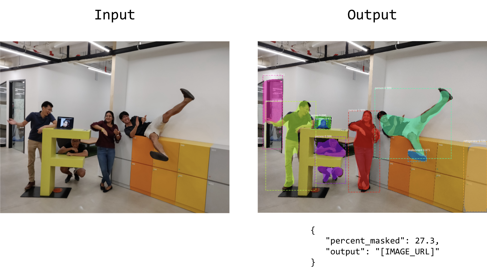

# FireVisor Developer ML Test

## Preamble

This coding assignment is designed for people who have a good understanding of machine learning. There is no prior knowledge needed for instance segmentation models.

The focus of this assignment is to understand how you learn and explore a model. Please let us know if you are already familiar with this model.

## Introduction to Object Instance Segmentation

In image classification problems, there is usually a single object of interest. For that specific object, we build models to predict whether that object belongs to a specific class. For example, given a picture of an animal, the model should tell you whether it is a cat or a dog.

However, the real world is much more complex. What if there are cats and dogs in the image? What if we need to exactly know where the dogs are and where the cats are? What if they are overlapping, having a dog walking in front of a cat?

The real world is so complicated!

In the following tasks, we want you to explore the methods of AI-based image segmentation. Image segmentation techniques allow us to detect multiple objects, classify them separately and localize them within a single image.

**To start with, we highly recommend this read:
[A Brief History of CNNs in Image Segmentation: From R-CNN to Mask R-CNN](https://blog.athelas.com/a-brief-history-of-cnns-in-image-segmentation-from-r-cnn-to-mask-r-cnn-34ea83205de4)**

At FireVisor Systems we use object instance segmentation models to detect, classify and localize defects in industrial scale. We also make use of `transfer learning` to reduce the amount of data needed to train a model.

## The Task - Explore the Mask R-CNN model

After finishing the recommended read above, you should have a high-level understanding of the Mask R-CNN model. Now, we want you to train your own!

For this exercise, you can use the implementation done by matterport (link below). However, you are encouraged to use any other implementation.
[https://github.com/matterport/Mask_RCNN](https://github.com/matterport/Mask_RCNN)

We have multiple difficulty levels and recommend you to do them in order.

1. Retrain the model to detect an object of your choice.
2. Build a simple AI API
3. Modify the network

---

### Task 1. Retrain the model

Let's build our first model! We recommend you to read [the paper](https://arxiv.org/pdf/1703.06870.pdf) and [this article](https://engineering.matterport.com/splash-of-color-instance-segmentation-with-mask-r-cnn-and-tensorflow-7c761e238b46) to understand more in-depth how Mask R-CNN works. If you aren't familiar with this type of models, we highly recommend you to look at the [optional exploration task](#optional-exploration-task).

To build our new model we need a dataset first. So, find a new dataset or create your own to train a new model.

Here are some ideas:

* Your friend who is a poor soul working in a bio lab complains how tedious it is to analyze cells. You help her by building a model that can automatically [detect the nucleus](https://colab.research.google.com/github/navidyou/Mask-RCNN-implementation-for-cell-nucleus-detection-executable-on-google-colab-/blob/master/mask_RCNN_cell_nucleus_google_colab.ipynb#scrollTo=jBONWUhASZIO).
* You keep on finding dog poop in your neighborhood. You are in rage and want to monitor every single dog passing by. So, you build [a model to detect dogs](https://hackernoon.com/instance-segmentation-in-google-colab-with-custom-dataset-b3099ac23f35).
* You are crazy about Frisbee, so you want a model to find Frisbee discs in a given image. For this, you can go to the [COCO dataset](http://cocodataset.org/#explore) and specifically pick frisbee images.

Please commit your code to this repo and document the process of using/creating a dataset to build a new model. Give a brief evaluation on how your model's performance and commit some sample results your model produced.

---

#### Optional Exploration Task
This is not a required task, but it can help you understand the model better, if you have never worked in-depth with MaskRCNN before. 

1. Reproduce the example provided in the matterport repo here: [https://github.com/matterport/Mask_RCNN/tree/master/samples/balloon](https://github.com/matterport/Mask_RCNN/tree/master/samples/balloon)
2. Play around with `BalloonConfig` parameters and understand how they work. Note there are more config parameters like `TRAIN_ROIS_PER_IMAGE` and `RPN_ANCHOR_SCALES` than mentioned in the article!

After you have successfully created a model to detect balloons, please commit your code to this repo and document what kind of insights you got from experimenting with the parameters (a few paragraphs are fine).

> Side note: Balloon Dataset can be found in the [releases page](https://github.com/matterport/Mask_RCNN/releases).

---

### Task 2. Build a simple AI API

Now you have a model. The world can't wait to use your new Mask R-CNN model! But how can the world interface with your model? You need an API!

Build a simple REST API with `flask` or another framework of your choice. An API user should be able to post an image to your API and receive the image with drawn mask and the percentage between masks and unmasked pixels.

You have free control over the design of your API. Please note there are multiple correct ways to do this.

We will run your API for testing. So, make sure you document how we can run your API **without the need to do the model training**.

---

### Task 3. Modify the network

Most Mask R-CNN model uses `resnet101` as a backbone, which is a humongous model. According to the original paper, the inference time is lower bounded at 200ms which is very slow.

You have read that MobileNet [is extremely fast, while still remarkably accurate](https://hackernoon.com/creating-insanely-fast-image-classifiers-with-mobilenet-in-tensorflow-f030ce0a2991). Now, you really want to try it out.

The task is to use MobileNet with Mask R-CNN. Compare the performance briefly, what did you notice? Commit your code and document your process.

## Resources

It is not feasible to train the Mask R-CNN without a GPU. If you don't have a GPU accessible we recommend you to use [Google Colab](https://colab.research.google.com/). Colab is like a jupyter notebook on the Google cloud, moreover, they provide free GPU power for 12h every day.

Colab should be sufficient for the tasks, however, on special request, we can spin up a GPU server for a few days for you.

## Deliverable

For every task, commit the code you produced to this git repo in a *separate folder*. Make sure to:
 
 * Provide dependencies (e.g. requirements.txt)
 * Provide example result images & the finished trained model
 * Document how to run your code (!)

In addition, please document your process. Either in code, as markdown fields in a jupyter notebook or in a separate .md file.

If you attempt a task but haven't completed it, please do submit your process nevertheless.

## Evaluation

We are looking for clean and runnable code and concise and insightful documentation. The documentation of your process and your learnings is very important to us as it gives us some hints on how you tackle problems of this kind and how well you are able to communicate your learnings.

We are not looking for super optimized models. We don't require you to hyper tune the models to get the minimal loss and maximal accuracy.

Moreover, we will consider your background and are more lenient if you haven't worked on a similar project before.

## Notes

* Training a Mask R-CNN model with transfer learning should not take longer than 2h
* Feel free to use any tools you have at hand, no restrictions
* You are encouraged to pick other people's brain, as long as all the work produced is done by you.
* You are free to share this challenge